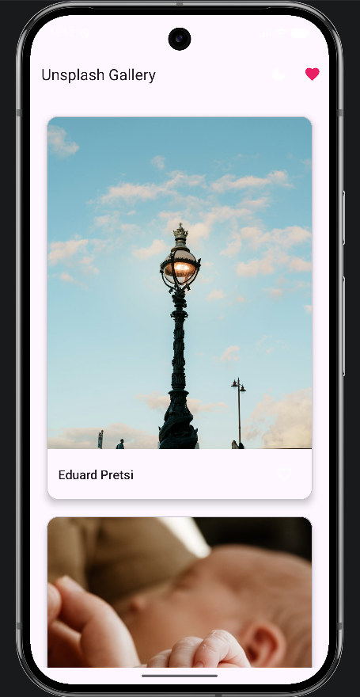
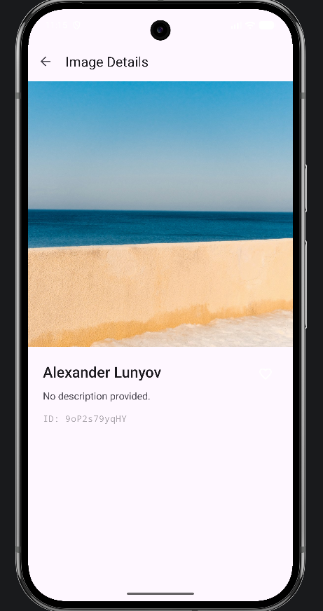
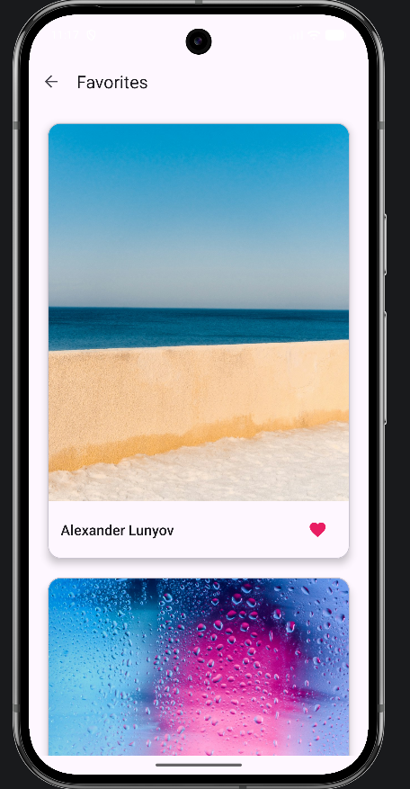
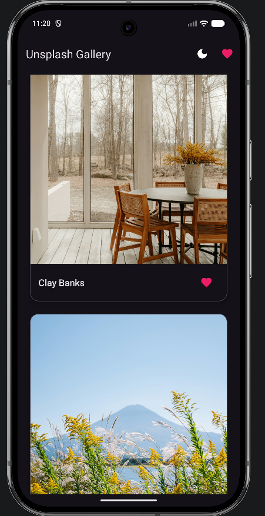

# CoolImages App

## Propósito da Aplicação
A CoolImages App é uma galeria de fotografias de alta resolução desenvolvida para o sistema Android. O objetivo principal do projeto foi explorar o desenvolvimento assistido por Inteligência Artificial (através do AntiGravity IDE). A aplicação atua como um portefólio, permitindo aos utilizadores explorar imagens, ver detalhes de cada fotografia, guardar os seus favoritos na memória do telemóvel e aceder ao conteúdo mesmo em modo offline.

## API Utilizada
O projeto consome a **Unsplash API** (especificamente o *endpoint* de fotografias aleatórias) para descarregar e apresentar as imagens.

## Capturas de Ecrã

## Instruções de Execução
Para compilar e correr o projeto corretamente, segue estes passos:

1. **Abrir o Projeto:** Abre o AntiGravity IDE (ou o Android Studio) e importa a pasta raiz deste projeto.
2. **Configurar a Chave de Segurança:** * Na zona lateral esquerda onde estão os ficheiros, procura pelo ficheiro oculto chamado `local.properties`.
   * Abre-o e adiciona a seguinte linha no final (substituindo pela tua chave real):
     `UNSPLASH_ACCESS_KEY=Client-ID COLA_AQUI_A_TUA_CHAVE`
3. **Sincronizar e Correr:** Aguarda que o sistema termine de ler as dependências. Depois, clica no botão verde "Run" (Play) na barra superior para iniciar a aplicação no emulador ou num telemóvel físico.